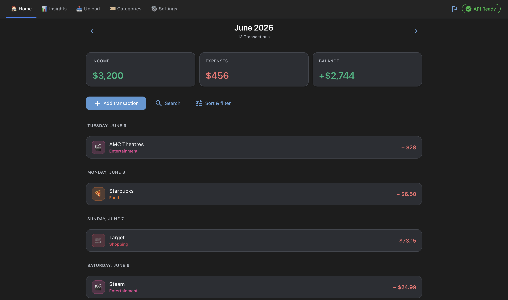
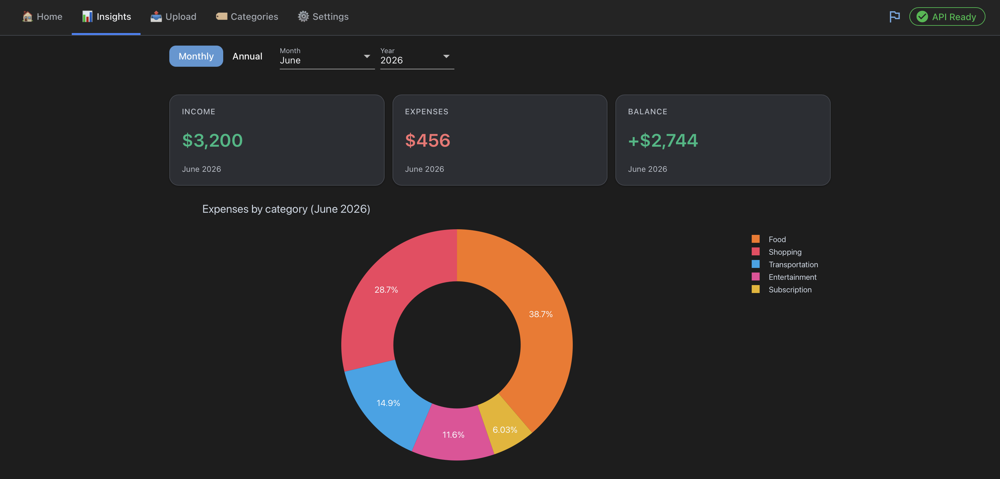
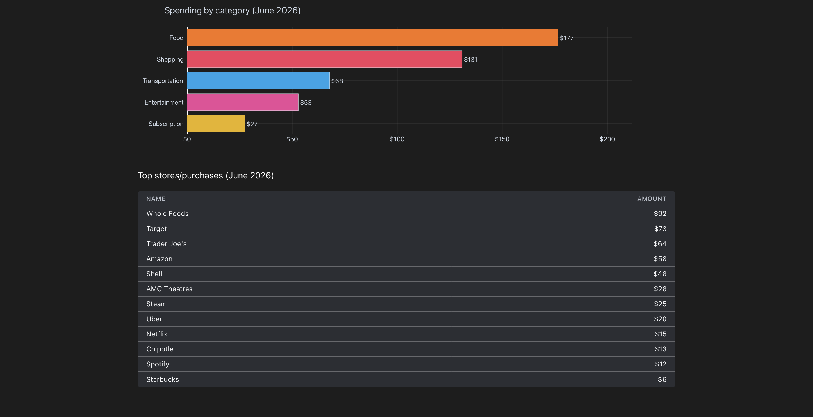
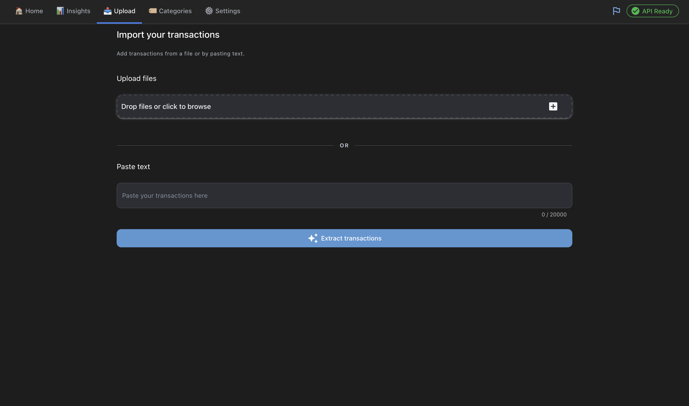
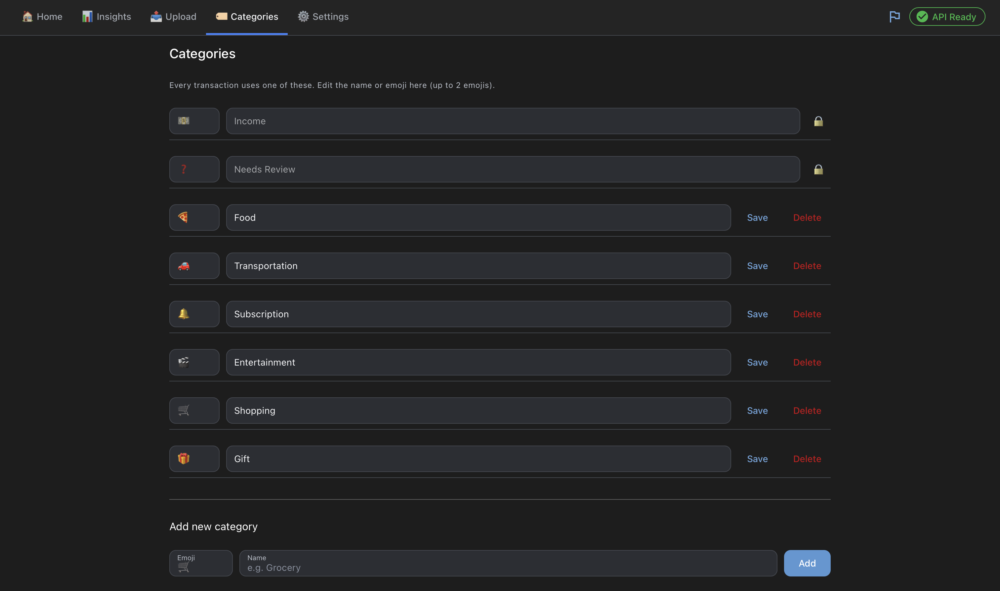

# Budget

   

A budget tracker that runs on your own Mac. Your data stays on your
computer in a single SQLite file, and the app opens in your web browser.

Type income and expenses in by hand, or upload a receipt or statement and have
the transactions pulled out for you. Reading uploads uses Claude and needs an
Anthropic API key. Everything else works without one.

## A look inside



| | |
| :--: | :--: |
|  |  |
|  |  |

## What it does

- Track income and expenses by category
- Upload a receipt or statement (PDF, PNG, JPG, TXT) and extract its transactions
- See where your money goes with monthly and yearly charts and a category breakdown
- Search and edit past transactions
- Remember a store's category so it fills in next time
- Export to CSV or Excel
- Auto-backup after every change, with a recently deleted list for undo

## Requirements

- macOS
- Git (macOS offers to install it the first time it is used)
- Internet on first launch, to download and set up the app
- An Anthropic API key, only for reading uploads. You paste it into Settings.

You do not need to install Python. Setup downloads the exact version the app
needs into its own folder.

## Install

### The app (easiest)

Download `Budget.zip` from the
[Releases page](https://github.com/samensafi/budget-app/releases/latest), unzip
it, and move `Budget` to your Applications folder.

The first time you open it, macOS warns that it cannot verify the app. This is
expected for a free app that is not signed through Apple's paid program, and does
not mean anything is wrong. To open it:

1. Double-click Budget and dismiss the warning.
2. Open System Settings, go to Privacy & Security, scroll down, and click "Open Anyway" next to the Budget message.
3. Click Open to confirm. You only do this once.

On older macOS, right-click Budget instead, choose Open, then Open again.

In some cases macOS still keeps the app quarantined. If it will not open or the
warning keeps returning, open the Terminal app, run this once, then try again:

```
xattr -dr com.apple.quarantine /Applications/Budget.app
```

On first launch Budget downloads what it needs and opens in your browser, a few
minutes the first time and seconds after, and it updates itself on each launch.

### From source (developers)

```
git clone https://github.com/samensafi/budget-app.git budget-app/app
cd budget-app/app
./run.command
```

It creates a private `userdata` folder next to the code and opens at
http://localhost:8080. To stop it, close the tab and press Ctrl+C. Update with
`git pull`.

## Updating

The app updates itself on each launch and tells you when it has. You can also
check from Settings under Updates. Updates only change the code, never your
`userdata` folder, so your data stays exactly as it was.

## Where your data lives

On first run the app creates a `userdata` folder next to itself for your
transactions, categories and backups, kept outside the code so it is never part
of anything you share. Uploads are the only thing that leaves your machine: they
go to Anthropic to be read and come straight back. Your API key is stored
locally in your own database file.

## Built with

NiceGUI, SQLite, pandas, Plotly and the Anthropic API.

## License

Budget is released under the PolyForm Noncommercial License 1.0.0, free to use
and modify for noncommercial purposes. See [LICENSE](LICENSE) for the full terms.
